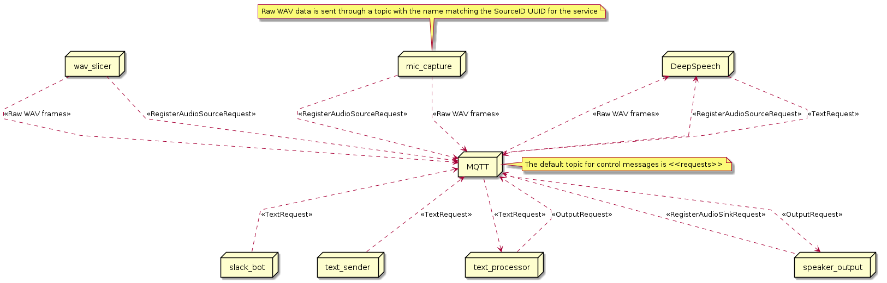

# diy-jarvis

This repo contains the services that make up a simple DIY voice assistant framework. The components of this framework are broken up into docker images for easier development. These images are

| Image | Description | Parameters |
| ----------- | ----------- | ----------- |
| diy-jarvis-builder | Used for development and as the build container in our CI/CD pipeline ||
| diy-jarvis-mic-capture | Captures a number of seconds of microphone data (determined by the `DURATION` environment variable)| `DURATION` controls how much audio to collect before sending it on to the processor|
| diy-jarvis-deepspeech | Uses the Mozilla Deep Speech library to transform raw wave files into text||
| diy-jarvis-wav-slicer | Slices up a wav `FILE` and feeds the chunks to the audio processor engine | `FILE` is the full path of the file (in the container) to process| 

## Designs

To get a better idea of how this system is organized, here are a few diagrams in the spirit of the [4+1 architechure view model](https://en.wikipedia.org/wiki/4%2B1_architectural_view_model) pattern ([paper](https://www.cs.ubc.ca/~gregor/teaching/papers/4+1view-architecture.pdf)).

### Usecases

### Process

## Getting started

### Usage

The quickest way to get the diy-jarvis system running is to use the docker-compose.yml at the root of our project to pull and execute the component service images. The simplest setup includes the following

~~~~bash
docker-compose up
~~~~

### Developing

The diy-jarvis-builder image includes all of the tooling required to build the various services in the diy-jarvis ecosystem.

~~~~bash

# Build the builder image from scratch using
make builder-image

# Run the builder image with pulse configured for localhost and
# mounted development directories using
make exec-interactive
~~~~

## Containerized development with PulseAudio

We've found that working in a containerized development environment helps us make our finished product more portable. In order to do that, we need to run pulseaudio on the host and connect it to the container.

~~~~bash
# First, we need to check if pulse audio is running on the host
pulseaudio --check -v

# Most likely, its not running so we'll need to start pulse audio daemon on the host allowing anonymous connections from the docker ip range, assuming it's 172.17.0.0/24 which appears to be the default for Docker Desktop on my mac
pulseaudio --load="module-native-protocol-tcp auth-ip-acl=127.0.0.1;172.17.0.0/24 auth-anonymous=1" --exit-idle-time=-1 --daemon

# On mac hosts, we can run a basic container that has pulseaudio installed to test our audio setup
docker run -it -e PULSE_SERVER=docker.for.mac.localhost -v ~/.config/pulse:/home/pulseaudio/.config/pulse --entrypoint bash --rm jess/pulseaudio

# We can also run a mic check with a 2 second delay from our selected default source (in) to default sink (out) to make sure everything's in order
pacat -r | pacat -p --latency-msec=2000
~~~~

For further reference on pulse audio commands to list and set default sources and sinks, see [this reference](https://gavv.github.io/articles/pulseaudio-under-the-hood/#configuration).